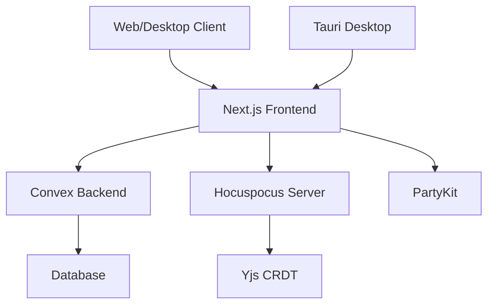
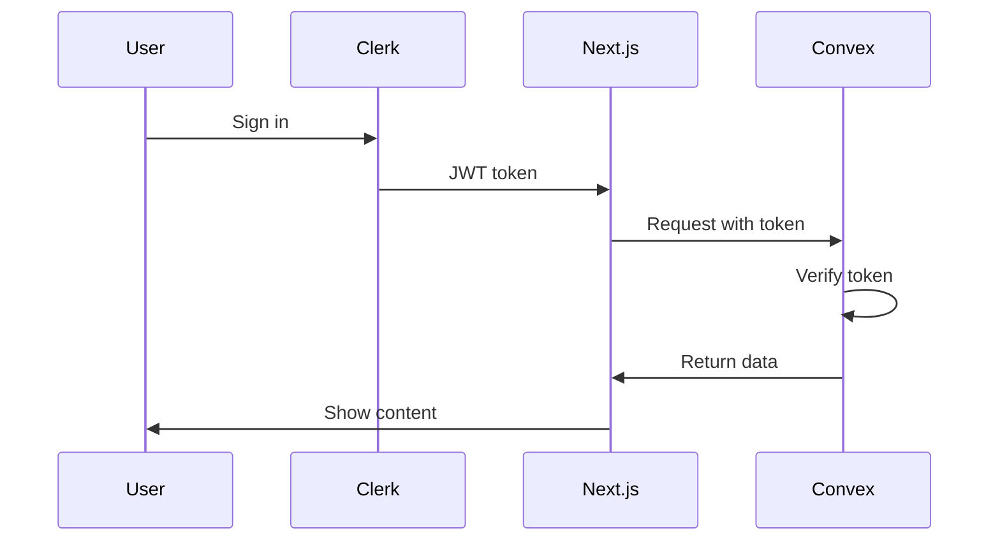

# Architecture

Pointer is built with a modern, scalable architecture that separates concerns and enables real-time collaboration.

## System overview



<CardGroup cols={3}>
  <Card title="Frontend" icon="desktop">
    Next.js 16 with React 19
  </Card>
  <Card title="Backend" icon="server">
    Convex serverless platform
  </Card>
  <Card title="Real-time" icon="bolt">
    Yjs + Hocuspocus + PartyKit
  </Card>
</CardGroup>

## Frontend architecture

### Next.js App Router

Pointer uses the Next.js App Router with:

```typescript
// app/layout.tsx
export default function RootLayout({ children }) {
  return (
    <ClerkProvider>
      <ThemeProvider>
        <ConvexClientProvider>
          <CommandMenuProvider>
            <DocumentHistoryProvider>
              {children}
            </DocumentHistoryProvider>
          </CommandMenuProvider>
        </ConvexClientProvider>
      </ThemeProvider>
    </ClerkProvider>
  );
}
```

**Provider hierarchy:**
1. **ClerkProvider**: Authentication and user management
2. **ThemeProvider**: Light/dark theme support
3. **ConvexClientProvider**: Real-time database connection
4. **CommandMenuProvider**: Global command palette
5. **DocumentHistoryProvider**: Version history tracking

### View system

Pointer organizes the UI into distinct views:

```typescript
type View = "home" | "note" | "graph" | "whiteboard" | "settings";
```

Each view has its own:
- Component (`/components/views/`)
- Header (`/components/views/headers/`)
- State management
- Routing logic

<Tabs>
  <Tab title="HomeView">
    Task management interface with due dates and organization
  </Tab>
  <Tab title="NotebookView">
    Rich text editor for single-user notes
  </Tab>
  <Tab title="CollaborativeNotebookView">
    Real-time collaborative editor with Yjs
  </Tab>
  <Tab title="GraphView">
    Knowledge graph visualization with ReactFlow
  </Tab>
  <Tab title="WhiteboardView">
    Excalidraw-powered infinite canvas
  </Tab>
  <Tab title="UserSettingsView">
    Application settings and preferences
  </Tab>
</Tabs>

## Backend architecture

### Convex

Convex provides the backend infrastructure:

```typescript
// convex/notes.ts
export const readNoteFromDb = query({
  args: { pointer_id: v.string() },
  handler: async (ctx, args) => {
    return await ctx.db
      .query("notes")
      .withIndex("by_pointer_id", (q) => 
        q.eq("pointer_id", args.pointer_id)
      )
      .first();
  },
});
```

**Key features:**
- **Queries**: Read data with live subscriptions
- **Mutations**: Write data with transactions
- **Actions**: Run arbitrary code (HTTP calls, AI, etc.)
- **Scheduled functions**: Cron jobs and cleanup tasks

### Data model

Pointer's data is organized into tables:

```typescript
// convex/schema.ts
export default defineSchema({
  notes: defineTable({...})
    .index("by_pointer_id", ["pointer_id"])
    .index("by_tenant", ["tenantId"])
    .index("by_parent", ["parent_id"]),
  
  notesContent: defineTable({...})
    .index("by_noteid", ["noteId"]),
  
  whiteboards: defineTable({...})
    .index("by_owner", ["tenantId"]),
  
  userTasks: defineTable({...})
    .index("by_tenant", ["tenantId"]),
  
  // ... and more
});
```

<Note>
  Indexes are crucial for performance. Every query should use an index.
</Note>

## Real-time collaboration

### Yjs CRDT

Pointer uses Yjs for conflict-free replication:

```typescript
import * as Y from "yjs";
import { HocuspocusProvider } from "@hocuspocus/provider";

const ydoc = new Y.Doc();
const provider = new HocuspocusProvider({
  url: "wss://your-server.com",
  name: noteId,
  document: ydoc,
});
```

**CRDT benefits:**
- Automatic conflict resolution
- Eventual consistency
- Offline-first capability
- No central authority needed

### Hocuspocus server

Hocuspocus manages WebSocket connections:

- **Connection management**: Handle connects/disconnects
- **Authentication**: Verify user access
- **Persistence**: Save to backend periodically
- **Presence**: Track active users

### PartyKit

PartyKit provides edge-based real-time:

```typescript
import { YPartyKitProvider } from "y-partykit";

const provider = new YPartyKitProvider(
  partyUrl,
  roomName,
  ydoc
);
```

## Desktop architecture

### Tauri

The desktop app uses Tauri 2:

```toml
[dependencies]
tauri = { version = "2", features = [] }
serde = { version = "1.0", features = ["derive"] }
```

**Architecture:**
- **Frontend**: Same Next.js app as web
- **Backend**: Rust process with IPC
- **Bridge**: Tauri commands for system access

```rust
#[tauri::command]
async fn read_file(path: String) -> Result<String, String> {
    // Rust implementation
}
```

<CardGroup cols={2}>
  <Card title="Web view" icon="window">
    Renders the Next.js app
  </Card>
  <Card title="Rust core" icon="gear">
    System integration and APIs
  </Card>
</CardGroup>

## State management

Pointer uses multiple state management patterns:

### Zustand stores

```typescript
import { create } from "zustand";
import { persist } from "zustand/middleware";

export const usePreferencesStore = create<PreferencesStore>()(
  persist(
    (set) => ({...}),
    { name: "pointer-preferences" }
  )
);
```

**Stores:**
- `preferences-store`: UI state and current view
- `tasks-store`: Task management state
- Other feature-specific stores

### React hooks

Custom hooks encapsulate logic:

- `use-note-editor`: Note editing state
- `use-folder-operations`: Folder management
- `use-task-manager`: Task CRUD operations
- `use-save-coordinator`: Auto-save logic

<Tip>
  Hooks make components simpler and logic more reusable.
</Tip>

### Convex subscriptions

Real-time data via hooks:

```typescript
import { useQuery } from "convex/react";
import { api } from "@/convex/_generated/api";

const notes = useQuery(api.notes.readNotesFromDb);
```

Convex automatically:
- Subscribes to changes
- Updates components
- Handles loading states
- Manages errors

## Authentication flow



<Steps>
  <Step title="User signs in">
    Clerk handles authentication
  </Step>
  <Step title="Token issued">
    JWT token stored in session
  </Step>
  <Step title="Requests authorized">
    Token sent with Convex requests
  </Step>
  <Step title="Data filtered">
    Convex filters by tenantId
  </Step>
</Steps>

## Data flow

### Single-user notes

```
User types → Editor state → Debounce (2s) → 
  Convex mutation → Database → Live query → 
  Other devices update
```

### Collaborative notes

```
User types → Yjs document → 
  WebSocket → Hocuspocus → 
  Other users' Yjs docs → 
  Their editors update
```

<Note>
  Collaborative notes use Yjs for real-time sync and Convex for persistence.
</Note>

## Performance optimizations

### Memoization

```typescript
const MemoizedComponent = React.memo(
  Component,
  (prev, next) => prev.id === next.id
);
```

### Lazy loading

```typescript
const Whiteboard = dynamic(
  () => import("@/components/whiteboard/Excalidraw"),
  { ssr: false }
);
```

### Indexes

All Convex queries use indexes:

```typescript
.withIndex("by_tenant", (q) => q.eq("tenantId", userId))
```

<CardGroup cols={2}>
  <Card title="React optimization" icon="react">
    Memo, useMemo, useCallback
  </Card>
  <Card title="Database indexes" icon="database">
    Fast query performance
  </Card>
  <Card title="Code splitting" icon="scissors">
    Smaller bundle sizes
  </Card>
  <Card title="Edge caching" icon="bolt">
    Fast content delivery
  </Card>
</CardGroup>

## Deployment

Pointer can be deployed in multiple ways:

<Tabs>
  <Tab title="Vercel (recommended)">
    - Zero-config Next.js hosting
    - Edge functions
    - Automatic HTTPS
    - Preview deployments
  </Tab>
  <Tab title="Self-hosted">
    - Docker containers
    - Custom domains
    - Full control
    - See [self-hosting guide](/development/self-hosting)
  </Tab>
  <Tab title="Desktop app">
    - Platform-specific builds
    - No hosting needed
    - Offline capability
    - See [desktop app docs](/platform/desktop-app)
  </Tab>
</Tabs>